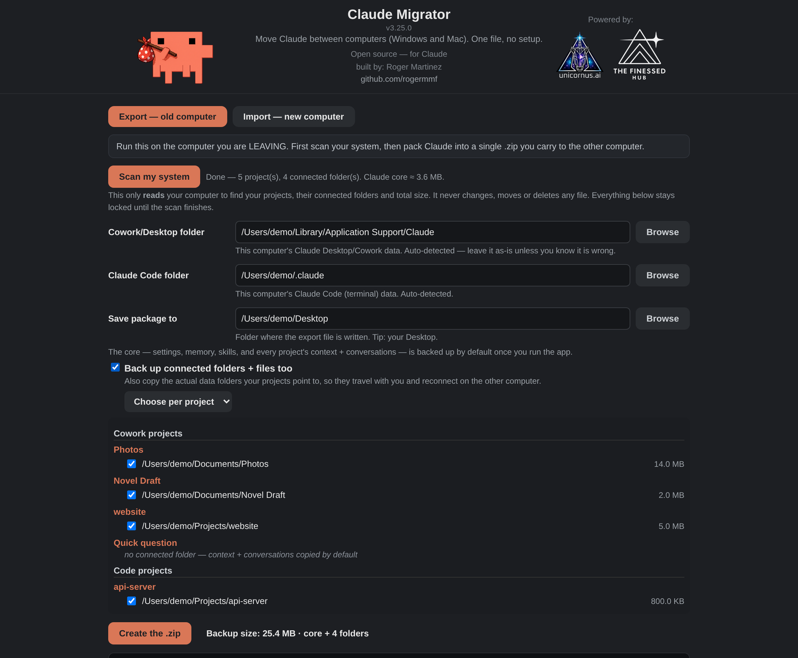

# Claude Migrator

  

Move your whole **Claude Desktop (Cowork) + Claude Code** setup between computers
(**Windows ⇄ Mac**) with one file. Export to a single `.zip` on the old machine,
import on the new one — projects, memory, skills, sessions, settings, and the data
folders your projects point to all come back and reconnect, with file paths
translated across operating systems.

*Open source — for Claude. Built by Roger Martinez. Powered by
[Unicornus.ai](https://unicornus.ai) and [The Finessed Hub](https://thefinessedhub.com).*



## Download

Grab the latest from the [Releases](../../releases) page:

- **Windows** — `ClaudeMigrator-win.exe` (double-click)
- **macOS** — `ClaudeMigrator-mac.tar.gz` (double-click to expand → `ClaudeMigrator.app`; first launch: right-click → **Open**)

No runtime or install — the engine and UI are embedded in a single binary. It opens
a small page in your default browser.

> The binaries are currently unsigned: on Windows choose "More info → Run anyway"
> at the SmartScreen prompt; on macOS right-click → **Open** on first launch.

## What it does

- **Export (old computer):** scans your machine **read-only**, then packs Claude into one
  `.zip` — the *core* (settings, memory, skills, and every project's context +
  conversations) plus, optionally, the actual data folders your projects point to.
- **Import (new computer):** brings everything back and reconnects each project to its
  folder, rewriting Windows⇄Mac paths so it all keeps working.
- **Preview (dry run):** see exactly what Import would restore, merge, and skip —
  before it writes anything.
- **Verified, not hoped:** Import ends with a report — how many conversations will
  actually resume and which connected folders exist on the new machine. Scan warns
  if Claude's storage layout looks newer than this version understands.

## Usage

1. **Quit Claude** on both computers.
2. **Old computer:** run it → **Scan my system** → choose what to back up → **Create the .zip**.
3. **New computer:** install Claude Desktop and sign in, **quit it**, then run the tool →
   point at the `.zip` → **Import**.

## How it works

- Reads Cowork data from `%APPDATA%\Claude` (Windows) or
  `~/Library/Application Support/Claude` (macOS), and Claude Code from `~/.claude` +
  `~/.claude.json` — resolved via environment variables, so it works for any user.
- Cross-OS path rewriting through tokenized roots (cowork, claude_code, home).
- **Merge-safe import** by default — adds your memory/skills/sessions into the new
  machine's Claude and never disturbs your current login or Projects.
- Excludes host-locked / bloat: `vm_bundles`, credentials, caches, `node_modules`.
- In the per-project picker, projects are labelled by their **connected folder name**
  (the live Cowork project titles are fetched from the server and aren't stored on disk).

## Build from source

Requires **Go 1.22+**.

```bash
go install github.com/rogermmf/claude-migrator@latest   # or:
bash scripts/build.sh      # -> dist/ClaudeMigrator-win.exe, dist/ClaudeMigrator-mac.tar.gz
go test ./...              # run the self-tests
```

Tagging a release (`git tag vX.Y.Z && git push --tags`) triggers the GitHub Actions
workflow, which builds both targets and attaches them to the Release.

## Privacy

Everything runs locally. It reads your Claude data only to build the package you ask
for, writes only that `.zip`, and makes no network calls and sends no telemetry.

## Privacy

Everything runs locally: no network calls (the UI is a localhost page), no
telemetry, no accounts, no third-party code. Machine-bound logins and connector
pairings are deliberately excluded from backups. Details in [PRIVACY.md](PRIVACY.md).

## Antivirus notice (Windows)

The exe is a new, unsigned binary, so SmartScreen/antivirus may pause and scan it
the first few times ("More info" → "Run anyway"). It carries full version
metadata and is open source — if in doubt, build it yourself (`go build .`) or
scan the release on VirusTotal. Code signing is planned; see docs/RELEASING.md.

## Found a bug?

[Open an issue](https://github.com/rogermmf/claude-migrator/issues/new/choose) — the
form takes a minute. Paste the log from the app's black box if you have it; blank out
any personal folder names first. There is also a **Report a bug** link inside the app.

## Support

Claude Migrator is free and MIT-licensed, built by [Roger Martinez](https://github.com/rogermmf)
([Unicornus.ai](https://unicornus.ai) · [The Finessed Hub](https://thefinessedhub.com)).
If it saved your migration, you can support development via the **Sponsor** button above. ☕

## License

[MIT](LICENSE)
